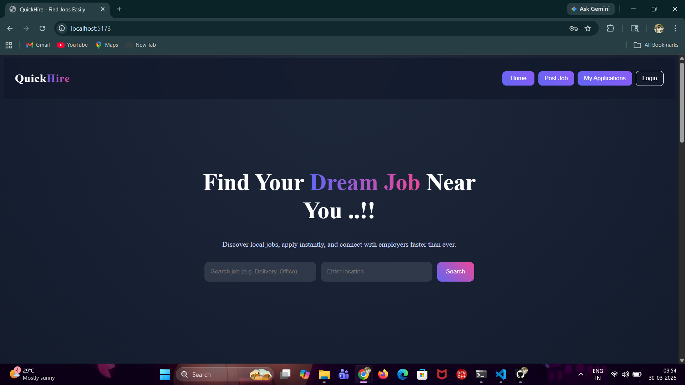
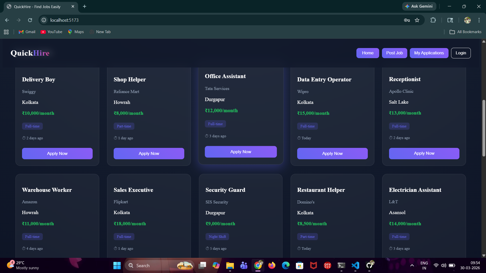
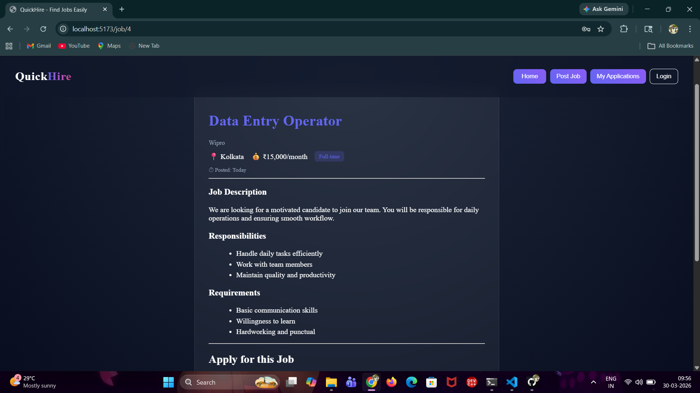

# 💼 QuickHire — Finds Job Easily

> A sleek, modern job portal built with React that helps users discover and apply for jobs effortlessly.

---

## ✨ About The Project

QuickHire is designed to simulate a **real-world job platform experience** with clean UI, smooth navigation, and practical features like job search and application flow.

It focuses on **user experience + product thinking**, not just UI.

---

## ⚡ Key Highlights

🚀 Fast & responsive job search  
📍 Location-based filtering  
🧾 Detailed job view with structured info  
📄 Resume upload system  
🎨 Modern dark UI with glassmorphism  
🔗 Smooth navigation using React Router  

---

## 🖥️ Preview

👉 Live Demo: *https://quickhire-job-portal-xi.vercel.app/*  

---

## 🧠 Core Functionality

- Browse jobs across multiple categories  
- View detailed job descriptions  
- Apply with user details + resume upload  
- Navigate between pages seamlessly  
- Clean and intuitive UI design  

---

## 🛠 Built With

- React (Vite)
- React Router DOM
- JavaScript (ES6+)
- CSS (Custom UI)

---

## 📸 Screenshots

| 🏠 Home | 📋 Jobs | 📄 Details |
|--------|--------|------------|
|  |  |  |
